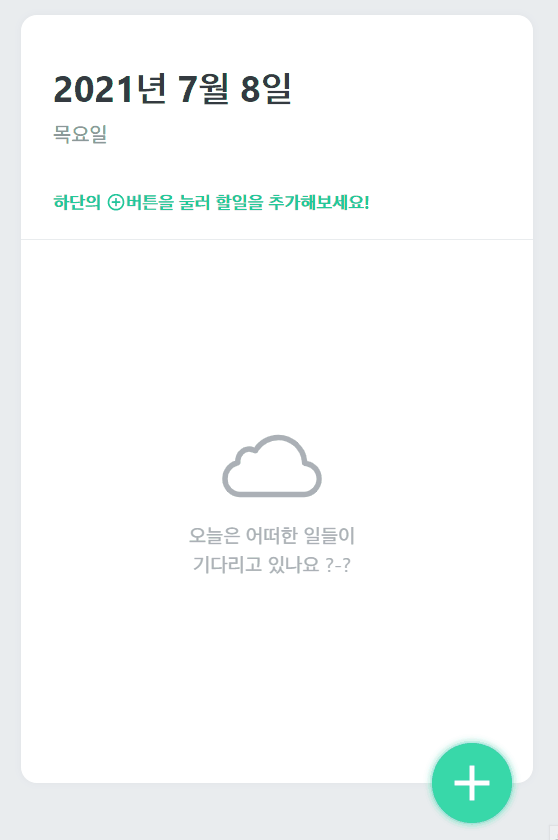

# 📅 React-TodoList-Front

**React.js** 학습을 목적으로 제작하게 된 투두리스트의 프론트엔드 단입니다.  

## 📃 개요

- **React.js** 연습을 목적으로 간단하게 구현한 TodoList입니다.
- **카카오 소셜 로그인** 후 투두리스트 기능을 사용하실 수 있습니다.
- 아이디어 및 디자인은 <a href="https://react.vlpt.us/mashup-todolist/">**벨로퍼트님 강의**</a>를 참고하였습니다.

## 💻 사용 기술

   

## 📜 간략한 설명

- 간단한 투두 리스트의 프론트엔드 단입니다. 백엔드 단에 대한 설명은 <a href="https://github.com/uncyclocity/React-TodoList-Back">ReacTodoList-Back</a> 레포를 참고해주시기 바랍니다.
- **카카오 OAuth 2.0**을 통해 로그인을 구현하였기에, 카카오 계정을 통한 로그인이 지원됩니다.
- **아토믹 디자인 패턴** 지향적으로 설계하였습니다.

## 🎬 시연 영상

